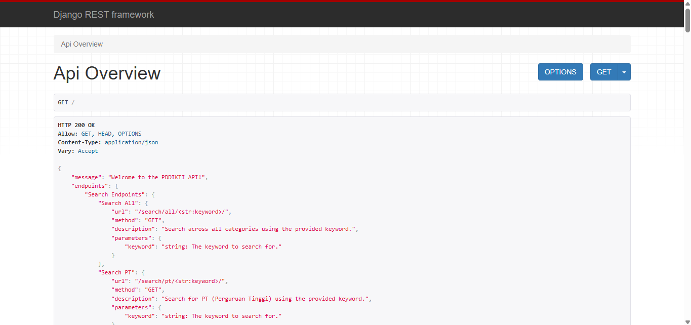

# PDDIKTI API

---

## ⚠️ PENGUMUMAN PENTING

**Akses API ini hanya tersedia sampai 10 Juli 2025.**

Karena tingginya trafik dan belum ada dukungan donasi untuk biaya hosting, mulai **10 Juli 2025** API ini **TIDAK DAPAT DIAKSES**.  
Agar API dan website ini tetap berjalan, dibutuhkan minimal **$50 USD/bulan** untuk biaya hosting.  
**Kamu bisa donasi mulai dari 1 USD** untuk mendukung layanan ini tetap aktif!  
Silakan dukung saya di [GitHub Sponsors](https://github.com/sponsors/ridwaanhall).

---

## INFO

> API ini telah di-update berdasarkan data baru di <https://pddikti.kemdiktisaintek.go.id/>

---

## Cara Pakai API

- **Dokumentasi lengkap (Bahasa Indonesia):**  
  [PDDikti Docs](https://pddikti-docs.ridwaanhall.com)  
  Mudah dan langsung bisa digunakan!

---

## API Documentation

- [https://pddikti-docs.ridwaanhall.com](https://pddikti-docs.ridwaanhall.com)

---

## Tampilan API Endpoint

- [https://api-pddikti.vercel.app](https://api-pddikti.vercel.app)

---

**Bantu agar layanan ini tetap hidup!**  
_Kamu bisa donasi mulai dari 1 USD via [GitHub Sponsors](https://github.com/sponsors/ridwaanhall)_
